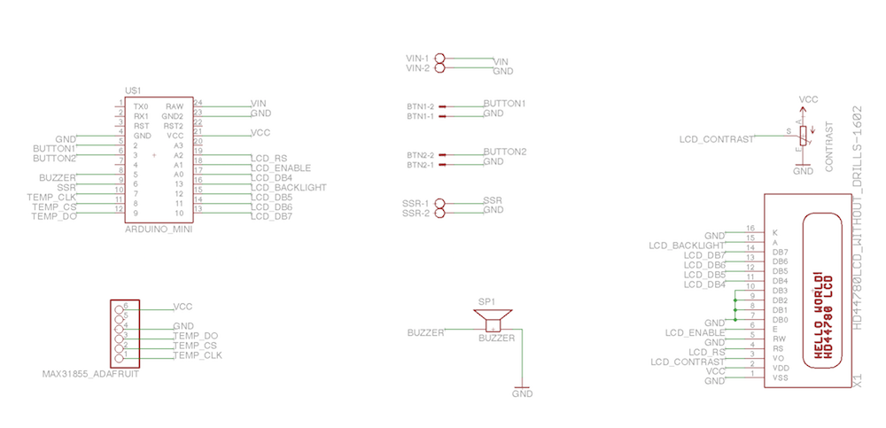
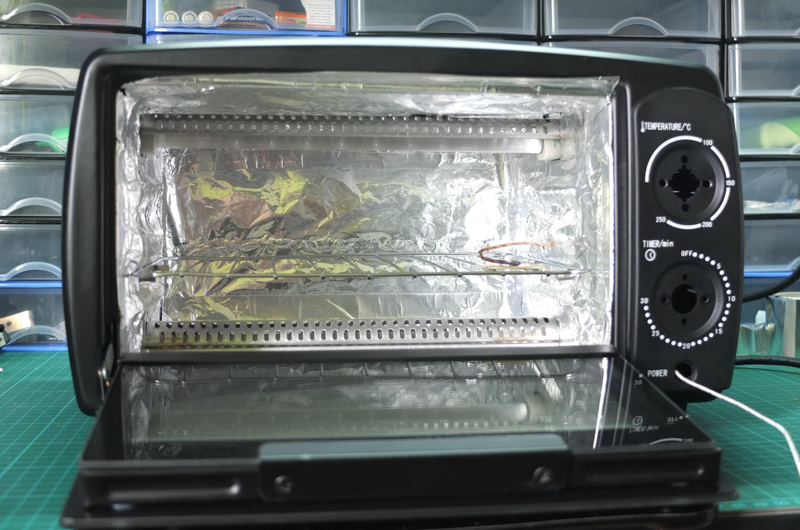
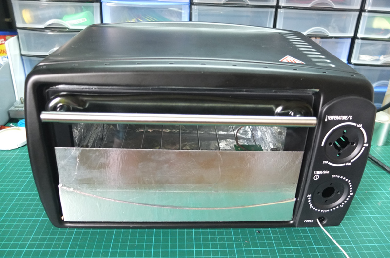
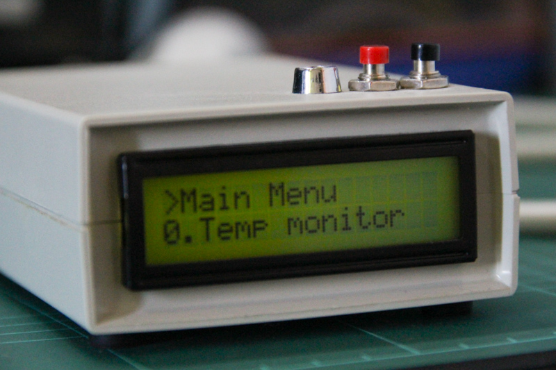
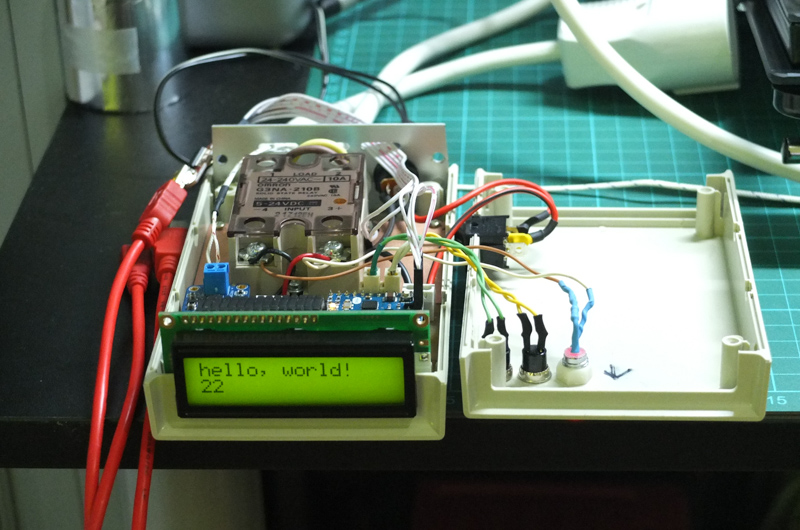
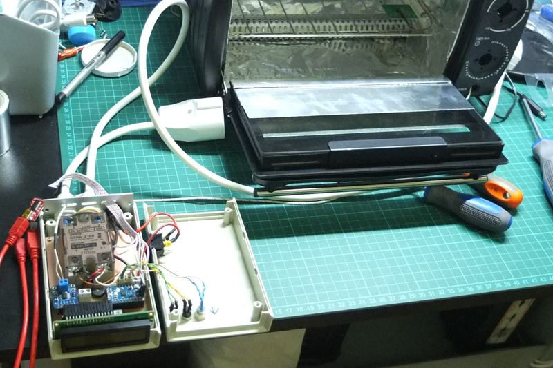
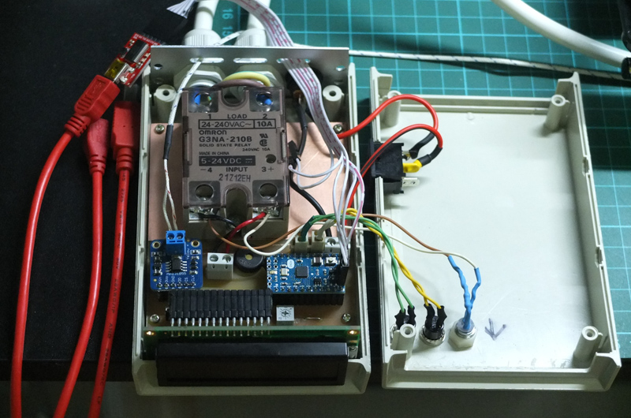
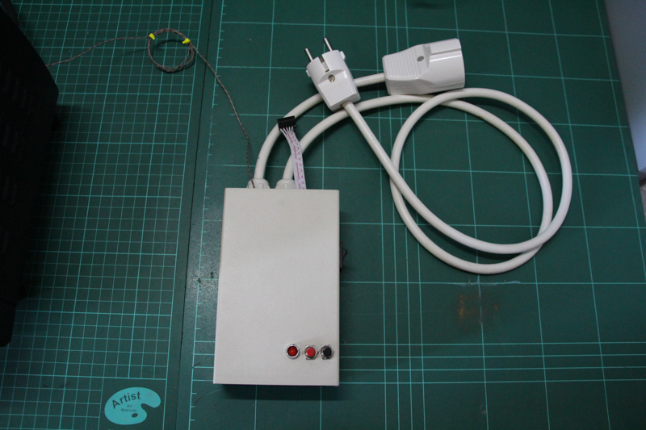
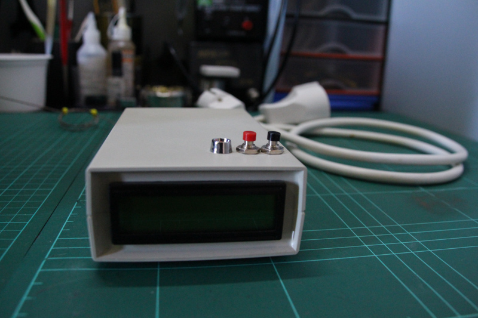

# Arduino Reflow Oven Controller

This is my custom design of an Arduino Reflow Oven Controller for reflow soldering of SMD components. 

Using a thermocouple to know the temperature inside the oven, this device controls a regular food oven using a SSR(Solid State Relay) for turning the power ON and OFF in order to get the desired temperature on each time to adjust it to the reflow profile. Is possible to choose between leaded and lead-free reflow profiles. The oven was previously modified to take out the thermostat and the timer to make possible to reach higher temperatures. 

The main hardware parts are:

- Arduino Mini
- K type thermocouple
- MAX31855 thermocouple amplifier (breakout from Adafruit) 
- SSR (Solid State Relay) 24-240VAC - 10A 
- LCD Display 16x2
- A couple of buttons and one led
- Some others components like cables, power connectors, power supply, etc...

All the EagleCad files and the Arduino firmware code are available at this repository. 

## Schema

## License

The MIT License (MIT)

Copyright (c) 2015 kalanda

Permission is hereby granted, free of charge, to any person obtaining a copy
of this software and associated documentation files (the "Software"), to deal
in the Software without restriction, including without limitation the rights
to use, copy, modify, merge, publish, distribute, sublicense, and/or sell
copies of the Software, and to permit persons to whom the Software is
furnished to do so, subject to the following conditions:

The above copyright notice and this permission notice shall be included in all
copies or substantial portions of the Software.

THE SOFTWARE IS PROVIDED "AS IS", WITHOUT WARRANTY OF ANY KIND, EXPRESS OR
IMPLIED, INCLUDING BUT NOT LIMITED TO THE WARRANTIES OF MERCHANTABILITY,
FITNESS FOR A PARTICULAR PURPOSE AND NONINFRINGEMENT. IN NO EVENT SHALL THE
AUTHORS OR COPYRIGHT HOLDERS BE LIABLE FOR ANY CLAIM, DAMAGES OR OTHER
LIABILITY, WHETHER IN AN ACTION OF CONTRACT, TORT OR OTHERWISE, ARISING FROM,
OUT OF OR IN CONNECTION WITH THE SOFTWARE OR THE USE OR OTHER DEALINGS IN THE
SOFTWARE.

## Some photos

